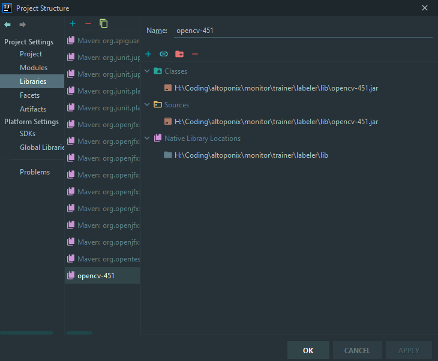
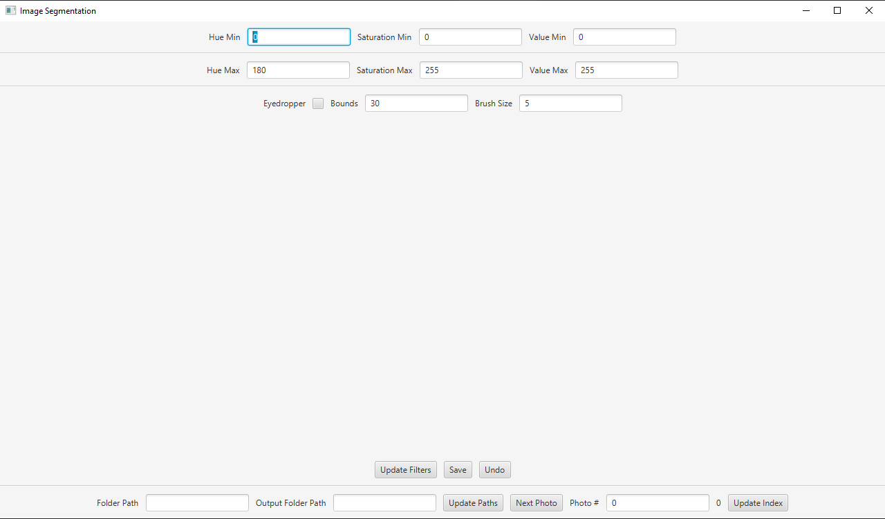

# Labeler

https://user-images.githubusercontent.com/55261018/147200322-40672246-d7b2-4463-8790-8ddddcb3da5a.mp4

## Installation
Open labeler as a project in IntelliJ

Go to File -> Project Structure -> Libraries

Hit + Java and select /lib/opencv-4xx.jar

Select the library and hit + on the right and select /lib/opencv_java4xx.dll on Windows or .dylib on Mac

Now go to the Main class and hit the run button

If it does not work due to a module not found, try deleting plant-segmentation.iml

## Usage
Set folder path and output path first and import the initial photo with _Update Paths_

Use _Next Photo_ to go to the next photo or change the Photo # to change to a specific file

Use the HSV minimums and maximums for color filtering and to create contours

Clicking in a contour will fill it and clicking outside a contour will simply draw using the brush size

If you make a mistake use the _Undo_ button

Clicking with the eyedropper selected will tune the HSV values based on your click using +- bounds

_Save_ will save to the output folder with the name filename_mask.png

## Online Resources: 
https://drive.google.com/drive/folders/1ZdKNRT2pHCuEI01Y8s0H-iAO9tshNuAC?usp=sharing
